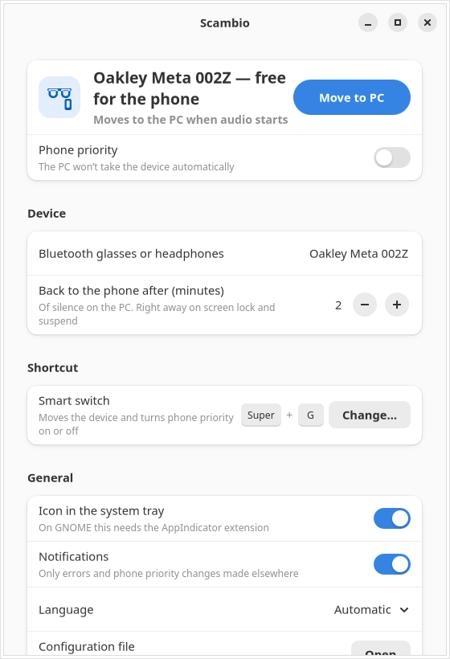
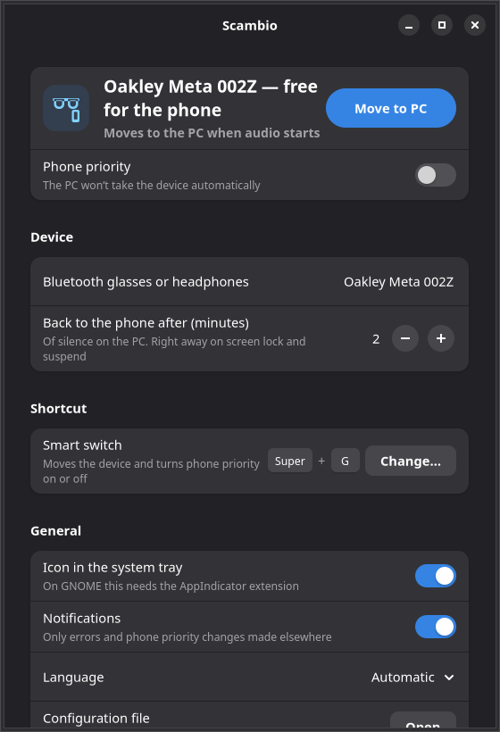

<p align="center">
  
</p>

<h1 align="center">Scambio</h1>

<p align="center"><b>Your audio follows you.</b><br>
Software multipoint for Bluetooth headphones and smart glasses on Linux.</p>

<p align="center">
  <a href="https://scambio.app">scambio.app</a> ·
  <a href="#install">Install</a> ·
  <a href="CHANGELOG.md">Changelog</a> ·
  <a href="LICENSE">GPL-3.0-or-later</a>
</p>

<p align="center">
  
</p>

Many Bluetooth headphones and smart glasses can only be connected to one device at a time.
Use them with your phone and your computer, and you end up in the Bluetooth menu every time
you sit down. Scambio does the switching for you:

- **Press play on your computer** and Scambio takes the device from your phone in a couple of
  seconds. Your video pauses during the switch and resumes in your ears.
- **Walk away** and, after two minutes of silence or when you lock the screen, your phone gets
  it back.
- **Switch whenever you like** with one shortcut (<kbd>Super</kbd>+<kbd>G</kbd>). Turn on
  *phone priority* and the computer keeps its hands off.

It lives in the system tray, has a small settings window, uses no network and collects nothing.

**Works with** Ray-Ban Meta and Oakley Meta glasses, and is meant for Bluetooth headphones without
multipoint too. Tested so far on Oakley Meta HSTN glasses with an iPhone, on Kubuntu with KDE Plasma;
see what we know about other models at [scambio.app/#compat](https://scambio.app/#compat). If your
headphones already support multipoint, you probably don't need Scambio.

## Install

Pair your headphones or glasses with the computer first (in your desktop's Bluetooth settings),
then install Scambio.

### Ubuntu and Debian

For Ubuntu 24.04 or later, Debian 13 or later, and distributions based on them (Linux Mint 22,
Pop!_OS 24.04, …).

1. Download **[scambio_1.0.0_all.deb](https://scambio.app/download/scambio.deb)** (also on the
   [GitHub release page](https://github.com/scambio-app/scambio/releases/latest)).
2. Open it with a double click and install it.

The package also adds the Scambio APT repository, so updates arrive with your regular system
updates. From a terminal, the same thing is:

```sh
wget https://scambio.app/download/scambio.deb -O scambio.deb
sudo apt install ./scambio.deb
```

To check a `.deb` downloaded by hand, compare it with the signed checksums of the
[release](https://github.com/scambio-app/scambio/releases): the signing key fingerprint is
`24A3 0DBE D897 3273 A486  CC73 86C8 855E 1251 E7E2`.

```sh
gpg --keyserver keys.openpgp.org --recv-keys 24A30DBED8973273A486CC7386C8855E1251E7E2
gpg --verify SHA256SUMS.asc SHA256SUMS && sha256sum --check --ignore-missing SHA256SUMS
```

### Other distributions (Flatpak)

If your distribution has Flatpak (Fedora, openSUSE, Arch, …):

```sh
flatpak install https://scambio.app/flatpak/scambio.flatpakref
```

or open [scambio.flatpakref](https://scambio.app/flatpak/scambio.flatpakref) with your software
center.

### From source

See [docs/development.md](docs/development.md).

## First start

Open **Scambio** from your applications menu and pick your headphones or glasses in
*Device*. That's it: from now on Scambio starts when you log in.

- **GNOME** doesn't show tray icons by default. Install the
  [AppIndicator and KStatusNotifierItem Support](https://extensions.gnome.org/extension/615/appindicator-support/)
  extension to get the icon, or use the settings window and the shortcut.
- The shortcut can be changed in your desktop's keyboard settings (on KDE Plasma: *System
  Settings → Shortcuts → Scambio*).
- The Flatpak asks your desktop for permission to start at login. If you said no, Scambio runs
  only while you have it open.

<p align="center">
  
</p>

## Using Scambio

Scambio works on its own; most days you never touch it.

| You want to… | Do this |
|---|---|
| Listen on the computer | Just press play. Scambio takes the device from the phone, pauses the video for the couple of seconds the switch takes, then resumes it in your ears. |
| Give it back to the phone | Nothing: after 2 minutes of silence (change it in *Settings*), when you lock the screen or before suspend, the phone gets it back. |
| Switch by hand | Press <kbd>Super</kbd>+<kbd>G</kbd>, or use *Move to PC* / *Hand back to the phone* in the tray menu or the settings window. Handing it back with the shortcut also turns on *Phone priority*; taking it again turns it off. |
| Keep the computer's hands off | Turn on **Phone priority** (tray menu or settings). The computer won't take the device until you turn it off or press the shortcut. |
| Use other headphones | *Settings → Device*: pick any paired Bluetooth headphones. Hand the current device back to the phone first. |
| Check what's happening | `scambio status` in a terminal (Flatpak: `flatpak run app.scambio.Scambio status`). |

Advanced timings and ignored apps live in `~/.config/scambio/config.toml` (Flatpak:
`~/.var/app/app.scambio.Scambio/config/scambio/config.toml`); *Settings → Configuration file*
opens it. After editing, quit Scambio from the tray and open it again from the menu.

### Uninstall

- `.deb`: `sudo apt remove scambio` (this also removes the Scambio APT source).
- Flatpak: `flatpak uninstall app.scambio.Scambio`.

Your settings stay in your home folder; delete the folders above if you want them gone.

## FAQ

**Does it drop my phone calls?** Not in our tests with WhatsApp calls on an iPhone: if the computer
takes the device mid-call, the call stays on your phone's speaker or earpiece; press the shortcut to
send the device back to the phone. Regular phone calls and Android aren't tested yet.

**Does it need root or a background service with special rights?** No. It runs as your user and
talks to BlueZ, PipeWire and your desktop over D-Bus. It never pairs, unpairs or trusts devices.

**Where is the tray menu?** Click the glasses icon in the system tray: it shows where the device is and lets you switch, toggle phone priority, open the settings or quit.

**Is there a Mac version?** It's coming as a paid app. Join the waitlist at
**How Scambio is made.** One person at Fermich srl directs the project, makes the product decisions
and tests it every day with real glasses and a real phone. The specifications, code reviews, design
and many of the hardware measurements are written with Anthropic's Claude; the code, tests and
packaging are written by OpenAI's Codex from those specifications. Every product decision,
specification, review and hardware measurement is documented in [`docs/`](docs/) (in Italian), and
the rules the agents follow are in [AGENTS.md](AGENTS.md). made.** Designed, reviewed and tested by a human on real hardware; written with
AI coding agents. Every product decision, specification, security review and hardware measurement
is documented in [`docs/`](docs/) (in Italian), and the rules the agents follow are in
[AGENTS.md](AGENTS.md).

## License

Copyright © 2026 Fermich srl. Scambio is free software: you can redistribute it and/or modify it
under the terms of the [GNU General Public License](LICENSE), version 3 or (at your option) any
later version.

"Scambio" and its logo are not covered by the license; see [NOTICE.md](NOTICE.md). Scambio is an
independent app and is not affiliated with, endorsed or sponsored by Meta Platforms,
EssilorLuxottica, Ray-Ban or Oakley.

Contact: hello@scambio.app
